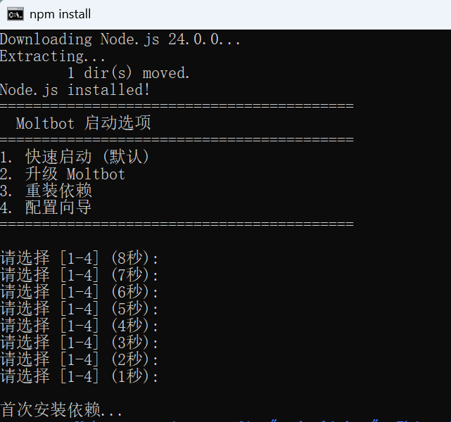

# OpenClaw 跨平台便携版

中文 | [English](README.md)

无需安装，支持 Windows / Linux / macOS 一键运行！

Windows : 双击 `run.bat` 
Linux / macOS  :  chmod +x run.sh && ./run.sh

首次运行会自动下载Node.js和依赖。
## ⚠️ 首次使用必读

### 1. 修改配置文件 `openclaw/openclaw.json`

**必须修改以下敏感信息（否则无法正常使用）：**

- **第7行** `apiKey`: 替换为你的 Nvidia API Key （获取自https://build.nvidia.com/settings/api-keys）
- **第60行** `botToken`: 替换为你的 Telegram Bot Token（获取自@BotFather）
- **第62行** `allowFrom`: 替换为你的 Telegram User ID（获取自@userinfobot）
- **第66行** `proxy`: 替换为你的Telegram代理地址（可空）

## 配置文件
- **APIKey环境变量**: `openclaw/.env`
- **自定义模型配置文件**: `openclaw/openclaw.json`

官网: https://openclaw.ai/

---

关注我的 X: https://x.com/flateaves 
